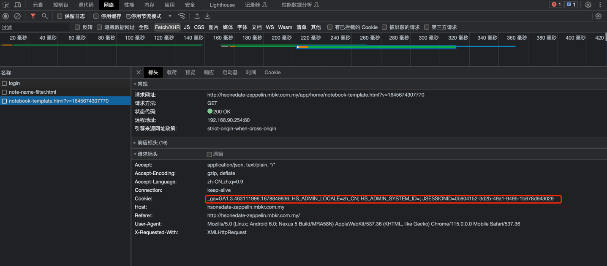

>环境准备及运行  
> bart.x.lu

# 环境准备
- allure  
下载 [allure](https://repo.maven.apache.org/maven2/io/qameta/allure/allure-commandline/2.9.0/)
并安装，下载之后解压并为添加到环境变量中 

- 三方库
```shell
pip3 install  -r  requirements.txt
```

- 访问 Oracle 客户端安装
下载 [oracle client](https://www.oracle.com/database/technologies/instant-client/linux-x86-64-downloads.html)
- 1、下载 windows x86版本
- 2、将压缩包解压缩
- 3、并将解压缩的文件添加环境变量


- 启动spark本地server web 服务【非必须】
```shell
cd ROOT_PATH/server
python3 Servers.py
```
 【非必须】

- 启动调度机器上的 web 服务
```shell
cd ROOT_PATH/server
python3 Servers.py
```


# 执行自动化用例

按规则筛选自动化

配置 pytest.ini 文件

如：
```text
testpaths=testcase/test_luxu/test_bustoods.py
```
设置 **testpaths** 即只执行 **testcase/test_luxu/test_bustoods.py** 文件内的所用测试用例


- 运行自动化用例
```shell

cd  $(ROOT_PATH)/server
python3 main.py
```

根据提示设置参数执行即可  


- 查看自动化报告 

[查看自动化测报告连接](http://testdev.hszq8.com/#/tools/bigdata_report)


# 使用手册

##  造数据 zeeoelin 使用步骤

[脚本地址](common/zeeplink/transFileToHive.py)

确保安装 python3,以及三方库 pandas、requests 如果已经安装则忽略
```shell
pip install pandas pandas
``` 

  

#### 使用示例
```python

host = "172.33.69.37"               #zeppelin 地址
port = 8890                         #zeppelin 端口
user="bart.x.lu"                    #zeppelin 登陆用户名
password="shxxxxx"               #zeppelin 登陆密码
notename = "notename"               # 请设置一个不存在的notename，防止与他人冲突
target_table = "tickrs_ods.ods_sgs_settle_trade_view_for_app_di"        #待写入的hive 表名
file = '/Users/luxu/Desktop/ods_sgs_settle_trade_view_for_app_di.xlsx'  # 待读取待excel文件
sheet = "Result 1"          #excel sheet 页


sheets = ["trade"]

for shee in sheets:
    a = TransFile()
    a.transmation(file, 0, 0, sheet=shee)
    a.dftoJsonStr()
    code = a.createSparkTemplate(table=target_table)
    print(code)

    obj = ZeepLinAPI(code=code,
                     host=host,
                     port=port,
                     # notename=notename
                     user=user,
                     password=password
                     )
    print(obj.header)
    obj.createNote()  # 创建note
    obj.createParagraph()  # 创建段落
    obj.runParagraph()  # 执行段落
    obj.removeParagraph()  # 删除
    obj.reomveNote()  # 删除note

```
#### 参数说明

##### host ：zeppelin 的登陆地址
##### port : zeppelin 的登陆端口
#### notename :#务必设置一个不存在的notename，防止与他人冲突
#### file: excel 上传到 hive的表数据，excel 的文件名尽量是表名
#### target_table :待写入到hive的表名
#### cookie:登陆zeppelin 的用户信息，获取方法如下

- F12 打开控制台，登陆zeppelin

- 拷贝 cookie


### ZeepLinAPI 方法说明

createNote 等效于页面上的


createParagraph


runParagraph


removeParagraph


reomveNote


