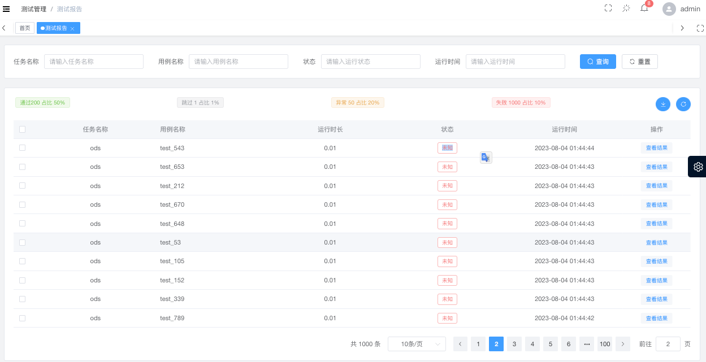

#

# 接口文档

### 写入测试平台
host=http://testdev.hszq8.com
url="http://10.73.11.54:9999/api/bigdata/case/report/"
path='/api/bigdata/case/report/'  

{"Content-Type": "application/x-www-form-urlencoded; charset=UTF-8"}
method : **POST**   
**Body** 

参数|描述|类型|是否必传
---|---|---|---
taskName|任务名称|str|是
caseName|用例名称|str|是
time|用例运行耗时|float|否
status|运行结果"1通过；2失败；3异常；4跳过；5其它"|int|是
execTime|运行时间 YY-MM-DD|str|是
text|运行结果信息，如错信息等|str|是

**返回**  
成功
````json
{
  "code": 200,
  "msg": "sucess"
}
````
失败 
```json
{
  "code": 500,
  "msg": "错误原因"
}
```

# 测报告展示样式



1、支持任务名称、用例名称、状态、运行时间筛选     
**任务名称**：使用模糊搜索+下拉框   
**用例名称**：使用模糊搜索+下拉框   
**状态**：使用下拉框      
**运行时间**：文本搜索     

2、通过、失败、跳过、异常的数量统计，百分比统计；统计结果与筛选联动    
3、每个任务每个测用例的结果已表单的形式展现    
4、支持结果导出 csv    