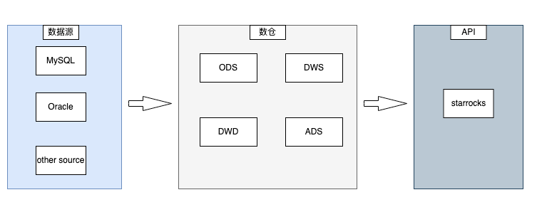
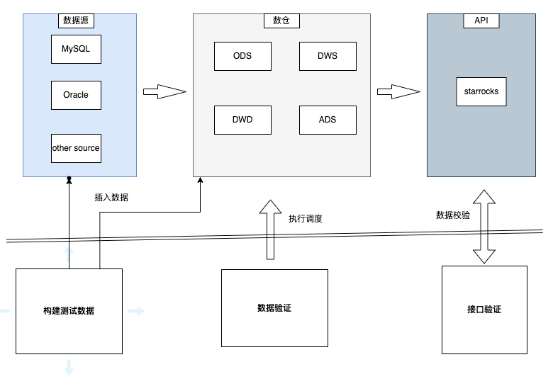
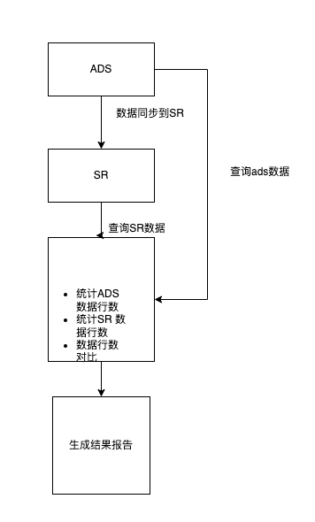
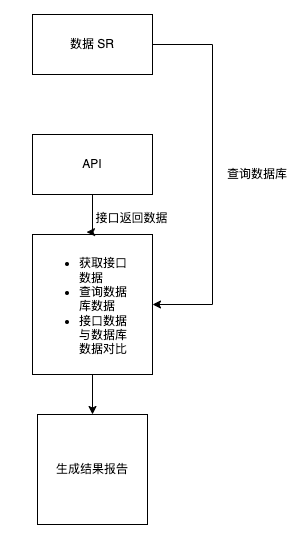
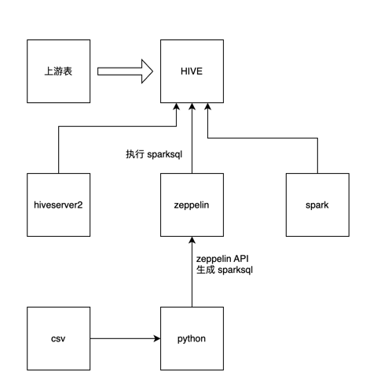

>背景
>大数据自动化测试是指在大数据测试过程中，利用自动化测试工具和技术来提高测试效率、将一些重复的操作用自动化来实现。


# 1 开发语言以及常用三方库

- 编码语言：Python 3.11


库名|主要作用|
---|---
cx_Oracle|访问Oracle数据库的驱动
PyMySQL|访问mysql数据库的驱动
pyhive|读取数仓HIVE 的数据驱动
pandas|数据分析工具
requests|接口请求
flask|轻型web框架
pytest|单元测试框架
allure-pytest|测试报告框架

# 2 运行环境

- CPU ： x86
- 操作系统：windows/centos


# 3 大数据基本处理流程



# 4 测试框架结构
## 4.1 工程结构说明

```text
.
├── main.py                                             #执行入口文件
├── Dockerfile
├── pytest.ini                                          #pytest配置文件
├── business                                            #自动化业务流程代码目录 
│       ├── APITestDemo                                 
│       └── luxu
├── common                                              #依赖库目录
│       ├── condb
│       ├── flask
│       ├── funcs.py
│       ├── paser
│       └── zeeplink
├── config                                              #常用配置文件目录
│       ├── __init__.py                                 #工程配置文件
│       └── sa_uat_dbconf.ini
├── data                                                #测试数据、数据驱动文件
│       ├── sourcedatacheckods.csv
│       └── test_ads_bss_report_stock_holder_list_di
├── report                                              #测试报告、日志文件
│       ├── allure.html
│       ├── allure_files
│       ├── task.log
│       └── test.html
├── requirements.txt                                    #工程三方库依赖文件
├── server                                              
│       ├── Servers.py
│       ├── testServer.py
│       └── useSparkToHIVE.py
├── testcase                                            # 测试用例目录 
│       ├── ads_sg_settlement_account_property_finance_di.csv
│       ├── test_demo
│       └── test_luxu
└── README.md
```


# 5 自动化设计方案
基本思路



## 5.1 ads 与 sr 数据量对比



#### 1 目标
保障数仓的 ads 层数据同步到 starrocks 上的数据没有丢失

#### 2 前置

- ads 层有满足测试的数据

#### 3 数据对比流程
主要步骤： 
- 1、通过hiveclient 访问数据仓， 获取 ads 层某一时间段内的数据量
- 2、执行数据同步调度将 数仓 ads 层的数据同步到 sr 上
- 3、通过 pymysql  访问starrocks ，获取sr上某一时间段内的数据量
- 4、分别计算 ads、sr 上每天的数据行数，并对其断言比较
- 5、最终对比结果记录到文件、或者测试报告、或者数据库中

将以上操作不步骤封装成一个执行方法，可以通过传参、**表名**、**时间** 来重复调用

#### 4 生成测试用例

通过调用 **3** 中的执行方法，传参数 （表名、数据时间）来完成测试用例

#### 5 数据驱动

- 1、数据驱动文件采用 csv,每列代表不同的参数名称 

exchange|name|hive_ads|hive_fliter|sr_ads|sr_filter
---|---|---|---|---|---
tickrs|18号报表|ads_bss_report_security_holding_pat_di|ds|ads_bss_report_security_holding_pat_di|report_date
tickrs|18号报表|ads_bss_report_security_holding_pat_di|ds|ads_bss_report_security_holding_pat_di|report_date
tickrs|18号报表|ads_bss_report_security_holding_pat_di|ds|ads_bss_report_security_holding_pat_di|report_date
tickrs|18号报表|ads_bss_report_security_holding_pat_di|ds|ads_bss_report_security_holding_pat_di|report_date


#### 6 定时任务
- 在UAT环境中每日定时去巡检比对 ads、sr 的数据    

使用crontab 定时任务的方式：如每日 10点运行 * 10 * * *

```shell
* 10 * * * python main.py $(date +"%Y-%m-%d")
```


## 5.2 接口自动化



#### 1 目标
验证接口的接口满足与实际返回一致

#### 2 前置

sr上有满足测试的数据

#### 3 数据对比
主要步骤:    

- 1、使用 python 的接口请求三方库 requests 来实现接口请求，并获取数据返回
- 2、通过自定义查询 sql 语句，使用 pymysql 来执行sql获取 sr 上数据库中的数据
- 3、sr 与 api 中返回的数据，首先比较其数据量行数
- 4、sr 与 api 中返回的数据，逐个字段比较其数据，数据库与接口是否都一致
- 5、最终对比结果记录到文件、或者测试报告、或者数据库中

将以上操作不步骤封装成一个执行方法，可以通过传参、**sql**、**接口参数** 来重复调用

#### 4 生成测试用例

通过调用 **3** 中的执行方法，传参数 （表名、数据时间）来完成测试用例


#### 5 示列

- 沙特可疑报表接口验证
[业务流程](business/APITestDemo/script_demo.py)

```python
import json
import pandas
from common.funcs import requestBase
from config import Starrocks as sr
from config import ShamFeatureLightAPI as conf
from common.condb.dbconnconf import ConConfig


class Sham_API_Demo(ConConfig):
    """
    沙特可疑报表
    """

    def __init__(self):
        """

        """
        self.path = "/sa/financialReport/suspicious/journal"
        self.sql = """select count(*) from sahm_feature_ads.ads_crm_suspicious_transactions_data_di where curr_date ='2023-04-23' """
        self.data = {'api_key': 'hs_bss',
                     'api_secret': '123456',
                     'beginDate': '20230423',
                     'endDate': '20230423',
                     'exchangeType': 'P',
                     # 'clientId': '829999993',
                     # 'clientName': 'ccc_819999993',
                     # 'stockCode': '222222',
                     # 'exceptionType': 'C',
                     # 'bizType': 1,
                     # 'orderBy': '',
                     'pageNo': 1,
                     'pageSize': 2000}

    @property
    def getAPIData(self):
        """
        获取接口返回数据
        :return:
        """
        return requestBase(method="post", apiParh=self.path, data=self.data, conf=conf)

    @property
    def getStarrocksData(self):
        """
        获取starocks 中的数据
        sql:数据库中查询语句
        :return:
        """

        coon = self.starrocks(host=sr.host, port=sr.port, username=sr.user, password=sr.password, database='')
        return pandas.read_sql(self.sql, coon)

    def assertDataRows(self):
        """
        数据库与接口数据量对比
        :return:
        """
        api_data = json.loads(self.getAPIData.text, strict=False)
        api_rows = len(api_data['data'])

        db_data = self.getStarrocksData.values.tolist()
        cnt_rows = db_data[0][0]
        print(api_rows)
        print(cnt_rows)
        assert api_rows == cnt_rows, "接口返回行数，与数据库返回行数不一致"


if __name__ == "__main__":
    obj = Sham_API_Demo()

    obj.assertDataRows()


```


[测试用例](testcase/test_demo/test_api_demo.py)

```python
import allure

from business.APITestDemo.script_demo import Sham_API_Demo


class TestDemo:

    @allure.feature("沙特可疑报表")
    @allure.story("所有数据")
    def test_4Report(self,):
        """
        :return:
        """
        obj = Sham_API_Demo()
        with allure.step("1、执行数据对比"):
            obj.assertDataRows()
```

## 5.3 构造测试造数
由于数仓 feature 环境测试过程中往往需要构造自己的测试数据，这里主要实现了通过 csv/excel 向HIVE 导入数据的方式



**大致步骤**
- 1、在csv/excel 中设置好待插入hive 的数据
- 2、通过 pandas 读取csv 文件生成一个json
- 3、结合上一步的 json 生成 sparksql 代码
- 4、调用 zeppelin 的 新建脚本 API 将sparksql 传入zeppelin
- 5、调用 zepelin 的执行 API，将脚本数据写入 hive


## 5.4 dws层数据发散测试


#### 1 目标
保障验证数仓dws 层 的宽表 没有数据发散

#### 2 前置

- dws 层有满足测试的数据

#### 3 数据对比流程
主要步骤：
- 1、通过 hiveclient 访问数据仓， 获取 dws 层的表若干分区或者整表的数据
- 2、根据 每个表的唯一列，来group By,count 确定数据是否有发散
- 3、最终对比结果记录到文件、或者测试报告、或者数据库中

将以上操作不步骤封装成一个执行方法，可以通过传参、**表名**、**时间** 来重复调用

#### 4 生成测试用例

通过调用 **3** 中的执行方法，传参数 （表名、数据时间）来完成测试用例

#### 5 数据驱动

- 1、数据驱动文件采用 csv,每列代表不同的参数名称,使用者仅需要维护

示例：

exchange|name|dws_db|dws_table|dws_filter|ods_db|ods_table|start_date|offset|agg_columns
---|---|---|---|---|---|---|---|---|---
mas|客户持仓表|dws|dws_mas_ast_client_stock_inf_di|ds|tickrs_ods|3333|2023-07-01|0|ds,client_id,stock_code
mas|用户交易成交明细表|dws|dws_mas_trd_client_trade_success_detail_di|ds|tickrs_ods|222|2023-07-01|1|ds,sequence_no

字段说明：
- exchange:市场必须是以下 vbroker、sham、tickrs、mas
- name: 自定义标识
- dws_db: dws 层的库名
- dws_table: dws 层表名
- dws_filter: dws 层数据的抽取条件，如 ds,trade_date,不填默认查整表
- start_date: 抽取数据的开始时间,如2023-07-01
- offset :抽取数据的结束时间与 start_date 的差值
- agg_columns: 聚合列，作为表的唯一列，比如 ID，orderId，若有多列组合构成唯一列，用英文逗号隔开 如："client_id,stock_code,monet_type"